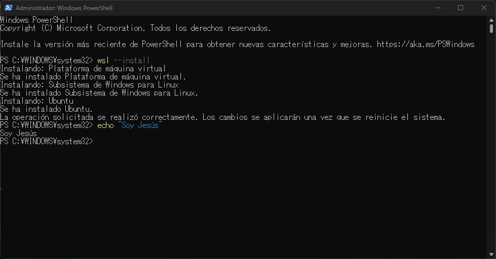
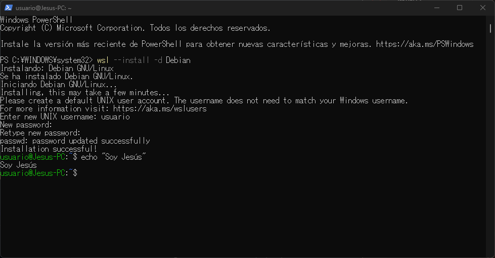
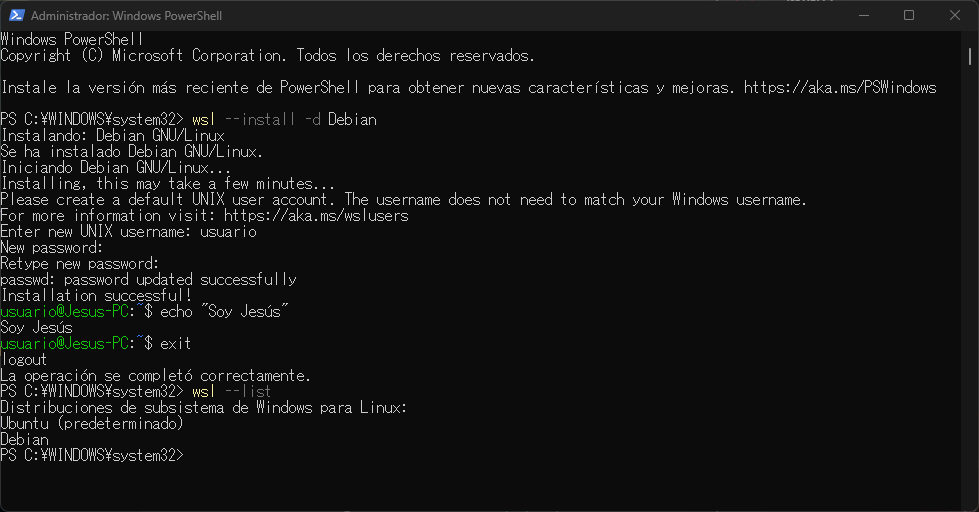
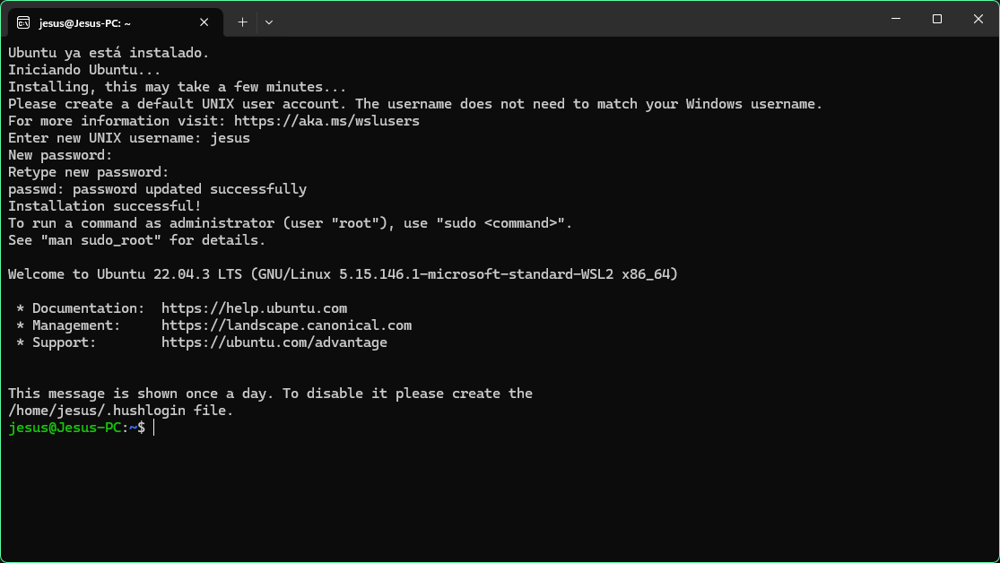

# Instalación

Para instalar WSL tenemos que hacer lo siguiente:

1. **Instalar WSL**:
   1. Abrimos Powershell como administrador y escribimos el siguiente comando:
      ```powershell
      wsl --install
      ```
      
    > Una vez que ha terminado, reiniciamos el PC
# Instalación de un Debian y un Ubuntu

1. **Instalación de Debian**:
   1. Abrimos la Poweshell y escribimos:
      ```powershell
      wsl --install -d Debian
      ```
   2. Esperamos hasta que se complete la instalación y cuando termine reiniciamos el PC.
   

2. **Instalación de Ubuntu**:
   > En mi caso, ubuntu se instaló a la misma vez que el WLS. Usando el comando ```wls --list``` lo podemos comprobar
      
Entonces, cuando reiniciíe el PC se me abrió automaticamente un CMD pidiendo que introduzca usuario y contraseña
      
      Pero si no se te instala por defecto despues de poner ```wsl --install``` hacemos lo siguiente:

   1. Abrimos la Poweshell y escribimos:
      ```powershell
      wsl --install -d Ubuntu
      ```
   2. Esperamos hasta que se complete la instalación y cuando termine introducimos el usuario y la contraseña.