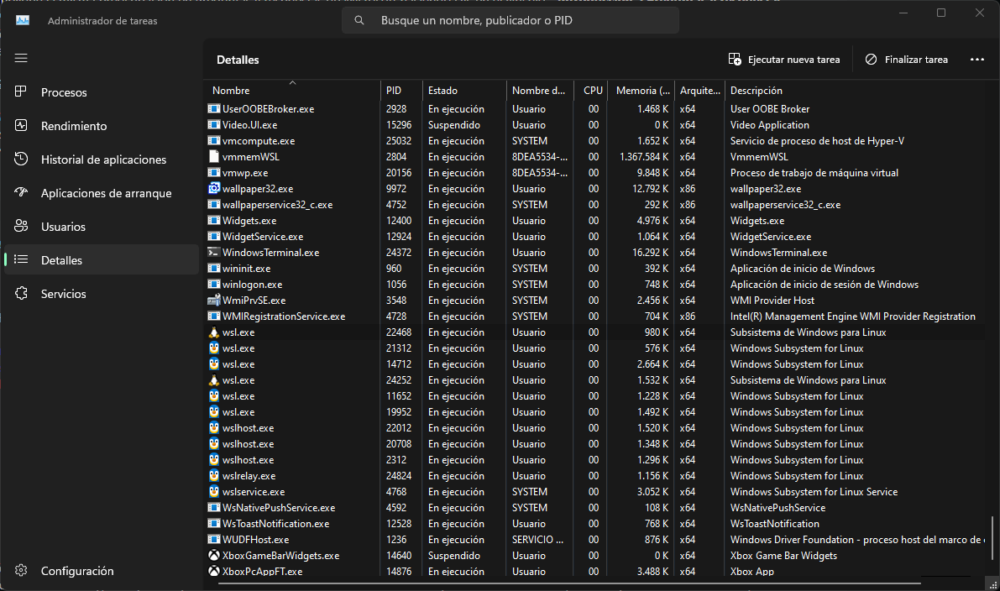
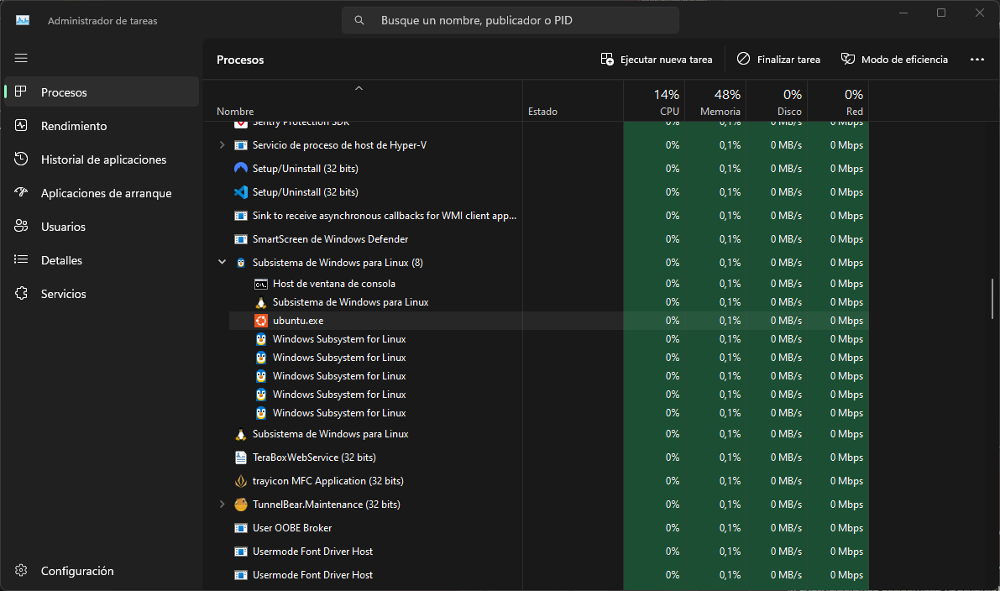

# Procesos asociados a WSL

WSL ejecuta varios procesos, como podemos ver, algunos de ellos son vmmemWSL, wsl.exe wslhost.exe

1. **Vmmem**: vmmem es un proceso de Windows que se utiliza para administrar la memoria de las máquinas virtuales en la función Hyper-V de Windows.
2. **wslhost.exe**: wslhost.exe es responsable de gestionar la integración entre los entornos Windows y Linux, facilitando la ejecución de comandos y aplicaciones de Linux dentro del sistema operativo Windows.
3. **Distribuciones específicas (Debian.exe, Ubuntu.exe, etc.)**: Estos procesos representan las instancias de las distribuciones de Linux específicas que se estan ejecutando.

> 
En esta imagen podemos ver como hay un proceso llamado ubuntu.exe que hace referencia a la distribución que estamos ejecutando